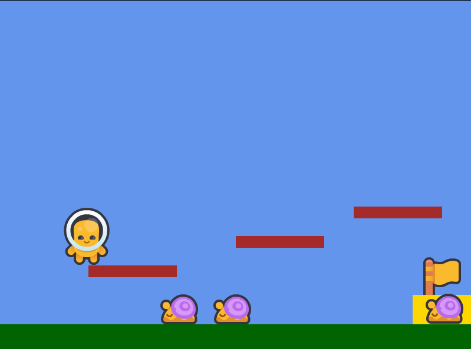

# Teste Prático Python Kodland - Davi Correia

# 🚀 Como rodar o projeto
## 1. Clonar o repositório
```
git clone https://github.com/davicorreia-dev/teste_pratico_Kodland.git
cd laranjinha_adventure
``` 

## 2. Criar um ambiente virtual
```
python3 -m venv venv
```

## 3. Ativar o ambiente virtual
- Linux/Mac
```
source venv/bin/activate
```

- Windows (PowerShell)
```
venv\Scripts\Activate
```

## 4. Instalar dependências
```
pip install -r requirements.txt
```

## 5. Rodar o jogo
```
pgzrun game.py
```
---

# 🕹️ Como Jogar

Bem-vindo ao Laranjinha Adventure! O objetivo é **chegar até a bandeira** no final da fase.

## 🎯 Objetivo

Alcance a **bandeira** para vencer o nível.

## 🎮 Controles
- ⬅️ **Seta Esquerda** – Move o personagem para a esquerda  
- ➡️ **Seta Direita** – Move o personagem para a direita  
- ⬆️ **Barra de Espaço** – Pula

## 💡 Dica
Cuidado com os caracóis!

# 👾 Registro do Jogo!
